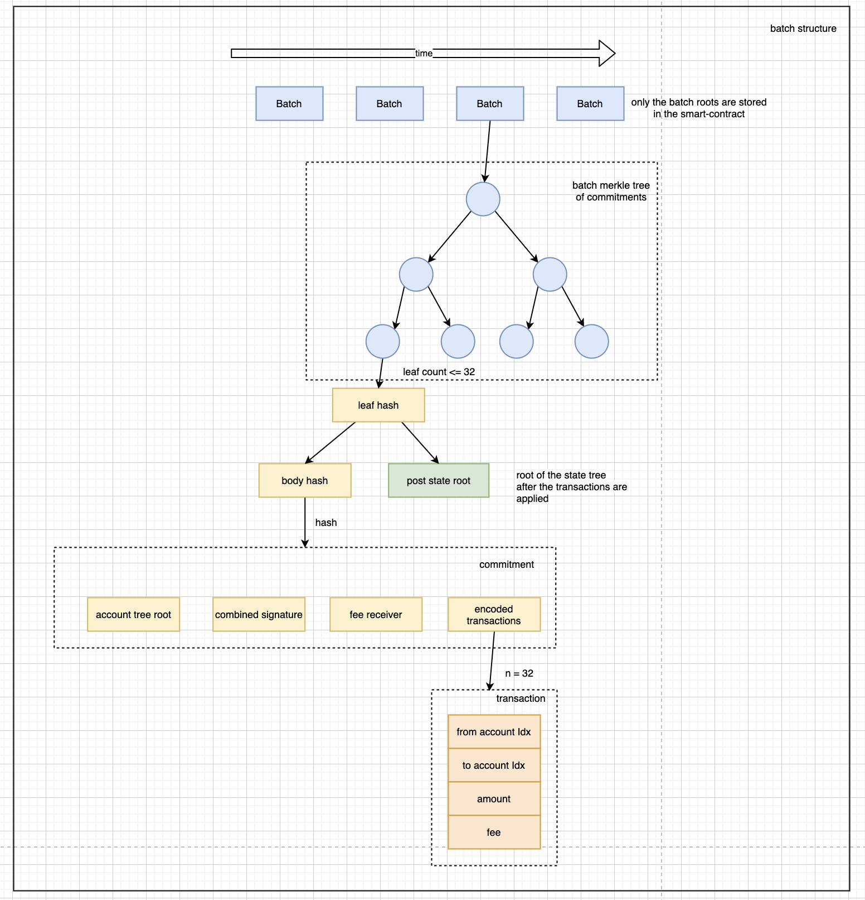

# 🗞 Batch Structure and Fraud Proofs

## Batch Submission



The coordinator submits a batch using `[submitTransfer](https://github.com/thehubbleproject/hubble-contracts/blob/7fc90522a9635d7378b86e49046f116b44a1ec58/contracts/rollup/Rollup.sol#L135)` . This batch contains an arbitrary number of smaller commitments, each of them contains `paramMaxTxsPerCommit` transactions (currently 32) and comes with a post state root. 

Commitments are not submitted directly to the contract, but in their individual parts. A commitment consists of an account stateroot, aggregated BLS signature (single curve point x,y coordinates), fee receiver address/index and the list of encoded transactions.

When calling `submitTransfer` the smart contract calculates the root to all the commitments using the following leaf structure:

```go
BODY_HASH_i := KECCAK(accountRoot, sigs_i, feeReceivers_i, txs_i) 
LEAF_HASH_i := KECCAK(stateRoot_i | BODY_HASH)
```

txs_i is the list of compressed / encoded transactions: 

[https://github.com/thehubbleproject/hubble-commander/blob/c60f42747e633dae53afd202e91550604667be66/bazooka/tx.go#L87](https://github.com/thehubbleproject/hubble-commander/blob/c60f42747e633dae53afd202e91550604667be66/bazooka/tx.go#L87)

After iterating through all leaves, they are merklized to one batchRoot. **This is the only data stored in the state of the smart contract. All data needed for verification of fraud proofs must be provided by the fraud prover.**

**Commitment hashing in the commander:**

[https://github.com/thehubbleproject/hubble-commander/blob/c60f42747e633dae53afd202e91550604667be66/bazooka/calldata.go#L54](https://github.com/thehubbleproject/hubble-commander/blob/c60f42747e633dae53afd202e91550604667be66/bazooka/calldata.go#L54)

[https://github.com/thehubbleproject/hubble-commander/blob/c60f42747e633dae53afd202e91550604667be66/core/batch.go#L74](https://github.com/thehubbleproject/hubble-commander/blob/c60f42747e633dae53afd202e91550604667be66/core/batch.go#L74)

## Fraud proofs

Conceptually, there are two different ways for a coordinator to commit fraud. Either he tries to submit a wrong post stateroot or he includes a transaction with am invalid signature.

In hubble there are two different endpoints for those two cases:

### Invalid state transfer

If the state root is faulty, then the fraud prover calls `[disputeTransitionTransfer](https://github.com/thehubbleproject/hubble-contracts/blob/master/contracts/rollup/Rollup.sol#L246)` and hands over the contract following evidence:

1. The batchID of the challenged batch 
2. The inclusion proof of the previous commitment and its post-stateroot (pre-stateroot of the batch in question)
3. The complete commitment (transfers, stateroot, accountstate) along with the inclusion proof within the fraudulent batch
4. The state for each sender and receiver of each transfer along with the merkle proofs for them within the commitment state root (see above)

The contract then executes each of the transfers on the provided state (4) and checks afterwards if this matches the claimed post-state. If not, the batch is rolled back, 1/3 of the staked amount is burned and the other 2/3 go to the fraud prover.

### Invalid signature

The function `disputeSignatureTransfer` takes following inputs:

1. The batchID of the challenged batch 
2. The complete commitment (transfers, stateroot, accountstate) along with the inclusion proof within the fraudulent batch
3. The inclusion proof of the fraudulent signature

The contract then verifies first that the sender account exists in the state (TBD: why is this here included as well? isn't this checked in the transfer already) and the sender pubkey exists in the account tree. 

It then needs to reconstruct the originally signed message and verifies the aggregate signature over all included pubkeys. If this fails, the batch is rolled back with the same consequences as above.

### Creating batches

[https://github.com/thehubbleproject/hubble-commander/blob/a00e2dd98154ccc41848de41894d31b5cdac1067/aggregator/aggregator.go#L124](https://github.com/thehubbleproject/hubble-commander/blob/a00e2dd98154ccc41848de41894d31b5cdac1067/aggregator/aggregator.go#L124)
