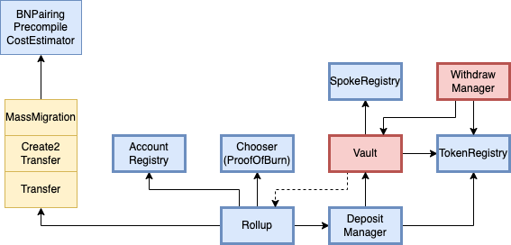

# [WIP] Contracts upgradeability

Notes from a brainstorming session. An incomplete list of possible solutions and their pros/cons.

## Upgrade through genesis accounts

Pros:

- Can arbitrarily change the state layout in storage
- Minimal changes required in the SCs

Cons:

- We lose batch/tx history (or need to aggregate data from many deployments)
- Requires admin (centralisation)
    - need to disable new deposits and batch all pending deposits
    - need to transfer tokens to the new Vault SC
    - disable old deployment to prevent forking
- Rollup address changes
- State dump can get too large

## Proxy pattern

Contracts with bold borders would need to be put behind proxies. Contracts in red store deposited tokens.

Pros:

- Preserves history
- No address change, can upgrade contracts in-place
- Easy to set up, but would require forking/taking over the `hubble-contracts` repository (many changes to SCs needed)
- Contracts don't change addresses
- Can transition into any other upgrade mechanism

Cons:

- Very difficult to upgrade when SC state layout changes
- Centralized (permissioned) without governance mechanism

## Using MassMigrations

Pros:

- Opt-in by users

Cons:

- Users might decide/forget to not transfer to the new version
- Most expensive gas-wise
- Need to implement mass-deposits
