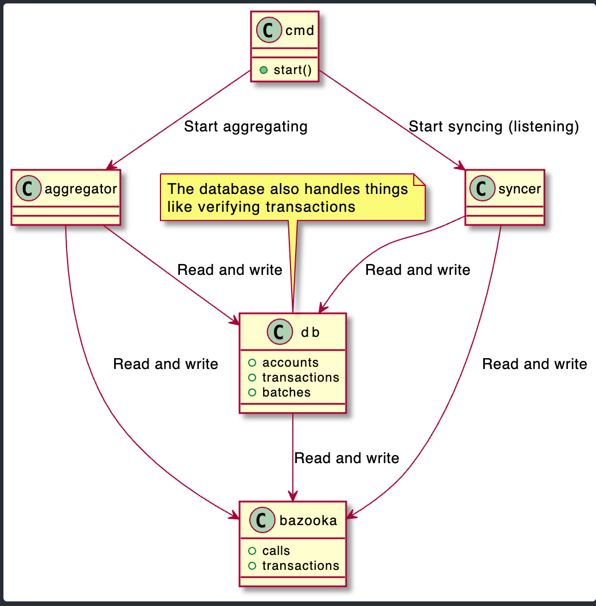

# 💻 Coordinator Architecture

## Overview

[https://www.figma.com/embed?embed_host=notion&url=https%3A%2F%2Fwww.figma.com%2Ffile%2FezRLRr2k94HhdHdLFSwuN7%2FHubble-Architecture%3Fnode-id%3D1%253A2](https://www.figma.com/embed?embed_host=notion&url=https%3A%2F%2Fwww.figma.com%2Ffile%2FezRLRr2k94HhdHdLFSwuN7%2FHubble-Architecture%3Fnode-id%3D1%253A2)



## Data Structures

[State and account tree are both described here](https://thehubbleproject.github.io/docs/Architecture)

The account tree stores the pubkeys at a given index

The state tree stores state for an account. One account can have multiple state leafs. The leaf format is described as `[balance, tokenID, nonce]` (**TBD**: verify in the code).

`AccountID` is the path of an account node encoded as int (01010101001)

`StateID` is the path of an state node encoded as int (01010101001)

## REST API

- GET `/user/state/{id}`  Fetches state for given id from the database

    ```go
    type stateExporter struct {
    	Balance   uint64 `json:"balance"`
    	AccountID uint64 `json:"account_id"`
    	StateID   uint64 `json:"state_id"`
    	Token     uint64 `json:"token_id"`
    	Nonce     uint64 `json:"nonce"`
    }
    ```

- GET `/user/account/{id}` Fetches the pubKey for a given account ID
- GET `/tx/{hash}` Fetches transaction status from the database
- GET `/user/{pubkey}` Fetches all states for the account from the database by pubKey. Returns list of following data structure:

    ```go
    type UserDetailsState struct {
    	Balance uint64 `json:"balance"`
    	StateID uint64 `json:"state_id"`
    	Token   uint64 `json:"token_id"`
    	Nonce   uint64 `json:"nonce"`
    }
    ```

- POST `/tx` Submit new transaction (custom encoding from smart contract)
- POST `/transfer` Submit new transfer transaction (json)
- POST `/massmigration` Submit new mass-migration transaction
- POST `/create2transfer` Submit new create2transfer (send to non existing account)

## Database Schema

TBD
