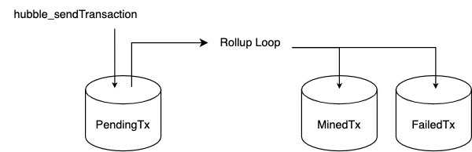
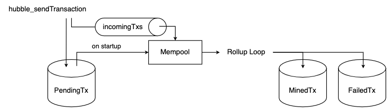
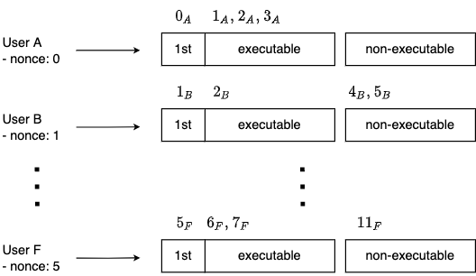

# Hubble Mempool

## High-level architecture

### Current

All transactions are added to `PendingTx` data structure in Badger. 
Rollup loop queries for all pending txs of given `txType` on each new iteration.



### Target

Transactions are stored in `PendingTx` data structure for persistence. 
On startup `Mempool` data structure is built from pending transactions queried from Badger. 
New transactions are pushed to the `Mempool` via `incomingTxs` channel.



## Implementation

Transactions in `Mempool` are tracked for each sender separately. 
They can be divided into _executable_ and _non-executable_ categories.

- Executable are txs that could be batched if applied one by one, i.e. the 1st tx has nonce equal to the account nonce and there's no gap in
  the nonce sequence.
- Non-executable are txs with nonces that would prevent them from being mined.



On a new Rollup Loop iteration we take the 1st executable transaction of each user, filter by the current `txType` and put them into
a `Heap` data structure.

For now, the rest of the description in pseudo code below.

### Pseudo code
```go
type Mempool struct {
	incomingTxs <-chan models.GenericTransaction
	userTxsMap map[uint32]UserTxs
}

type UserTxs struct {
	txs []models.GenericTransaction // "executable" and "non-executable" txs
	nonce uint // user nonce
	executableIndex int // index of next executable tx from txs
}

func NewMempool() *Mempool {
	// loads txs from DB and adds them to userTxsMap using addOrReplace()
	// sets user nonces from DB
}

func(m *Mempool) fetchIncomingTxs() {
	// fetches all txs from incomingTxs channel and adds them to userTxsMap / 
	// replaces some existing ones using addOrReplace()
}

func(m *Mempool) addOrReplace(tx models.GenericTransaction) {
	// adds a new transaction to txs possibly rebalancing the list
	// OR
	// replaces an existing transaction
	// sets executableIndex based on nonce
}

func(m *Mempool) getExecutableTxs(txType txtype.TransactionType) []models.GenericTransaction {
	result := make([]models.GenericTransaction)
	for userTx range userTxsMap {
		if executableIndex == -1 {
			continue
		}
		executableTx := userTx.txs[userTx.executableIndex]
		if (executableTx.Type == txType) {
			result = append(result, executableTx)
		}
	}
	return result
}

func(m *Mempool) getNextExecutableTx(stateID uint32) models.GenericTransaction {
	// checks if tx from userTxsMap for given user is executable, if so increments executableIndex by 1
	// returns txs[executableIndex]
}

func(m *Mempool) ignoreUserTxs(stateID uint32) {
	// makes subsequent getExecutableTxs not return transactions from this user state
	// this virtually marks all user's txs as non-executable
	m.userTxsMap[stateID].executableIndex = -1
}

func(m *Mempool) resetExecutableIndices() {
	// iterate over all UserTxs and set executableIndex to 0
}

func(m *Mempool) removeTxsAndRebalance(txs []models.GenericTransaction) {
	// remove given txs from the mempool and possibly rebalance txs list
}

func (m *Mempool) getExecutableIndex(stateID uint32) int {
    // returns current executableIndex for given user 
	return m.userTxsMap[stateID].executableIndex
}

func (m *Mempool) updateExecutableIndicesAndNonces(newExecutableIndicesMap map[uint32]int) {
    for stateID, index := range newExecutableIndicesMap {
		// calculate applied txs count and decrease nonce based on executableIndex difference
        userTxs := m.userTxsMap[stateID]
		txsCountDifference = userTxs.executableIndex - index
        userTxs.executableIndex = index
        userTxs.nonce -= txsCountDifference
    }
}
```

```go
// Max heap sorted by tx fee
type Heap struct {
	// heap internals
}

func NewHeap(txs []models.GenericTransaction) *Heap {
	// init the heap
}

func(h *Heap) peek() models.GenericTransaction {
	// get reference to the tx with the highest fee
}

func(h *Heap) pop() models.GenericTransaction {
	// remove the max tx from the heap
}

func(h *Heap) replace(tx models.GenericTransaction) {
	// pops max element, pushes new one to the heap and rebalances
}
```

```go
type RollupContext struct {
	mempool Mempool
	sucessfulTxs []models.GenericTransaction
	failedTxs []models.GenericTransaction
	executableIndicesCache map[uint32]int // map StateID -> ExecutableIndex before each commitment
}

func (r *RollupContext) rollupLoopIteration(txType txtype.TransactionType) {
	r.mempool.fetchIncomingTxs()
	txs := r.mempool.getExecutableTxs(txType)
	heap := NewHeap(txs)

	
	// Apply txs modifying Mempool and Heap data structures
	commitments := make([]models.Commitment, 0, MAX_COMMITMENT)
    for i := 0; i != MAX_COMMITMENT; i++{
        r.executableIndicesCache = make(map[uint32]int, MAX_TXS_PER_COMMITMENT)
	    commitmentTxs, err := r.CreateCommitment()
		if err == ErrNotEnoughTxs {
            r.mempool.updateExecutableIndicesAndNonce(r.executableIndicesCache)
			break
        }
		if err != nil {
		    return err
		}
        sucessfulTxs := append(sucessfulTxs, commitmentTxs)
	}

	// Clean up Mempool

	if len(commitments) < MIN_COMMITMENTS {
		r.resetExecutableIndices()
		r.mempool.removeTxsAndRebalance(r.failedTxs)
		// Move failedTxs from PendingTx to FailedTx in DB
		return
	}

	r.mempool.removeTxsAndRebalance(append(r.sucessfulTxs, r.failedTxs))
	// Move sucessfulTxs from PendingTx to MinedTx in DB
	// Move failedTxs from PendingTx to FailedTx in DB
	
	// Clean up RollupContext
}

func (r *RollupContext) CreateCommitment() ([]models.GenericTranscation, error) {
    commitmentTxs := make([]models.GenericTransaction, 0, MAX_TXS_PER_COMMITMENT)
    for i := 0; len(commitmentTxs) != MAX_TXS_PER_COMMITMENT; i++ {
        tx := heap.peek()
        if tx == nil {
			if len(commtimentTxs) < MIN_TXS_PER_COMMITMENT {
				return nil, ErrNotEnoughTxs
            }
            return commitmentTxs, nil
        }

        // save executableIndex for user before commitment
        if _, ok := r.executableIndicesCache[tx.FromStateID]; !ok {
            r.executableIndicesCache[tx.FromStateID] = r.mempool.getExecutableIndex(tx.FromStateID)
        }

        res := applyTx(tx)
        if res == ERROR {
            r.failedTxs = append(r.failedTxs, tx)
            r.mempool.ignoreUserTxs(tx.From)
            heap.pop()
        } else {
            nextTx := r.mempool.getNextExecutableTx(tx.From)
            heap.replace(nextTx)
            commitmentTxs := append(commitmentTxs, tx)
        }
    }
	return commitmentTxs, nil
}

```

### Notes
~~- Idea: store user transactions in a single list to avoid "rebalancing" between `pendingTxs` and `queuedTxs`. 
  Instead, use a pointer to mark the last executable transaction on the list.~~
~~- This pseudo code ignores the fact that txs are applied in multiple commitments. There can be a situation where we might need to revert some txs applied in commitment `N` (for instance because of not enough txs) but keep the txs applied in commitments `0 ... N-1`.~~
