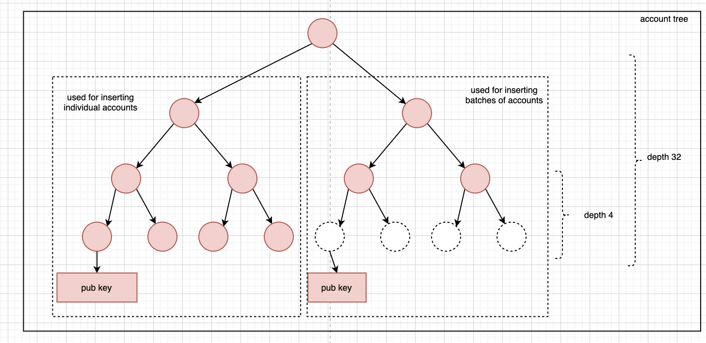
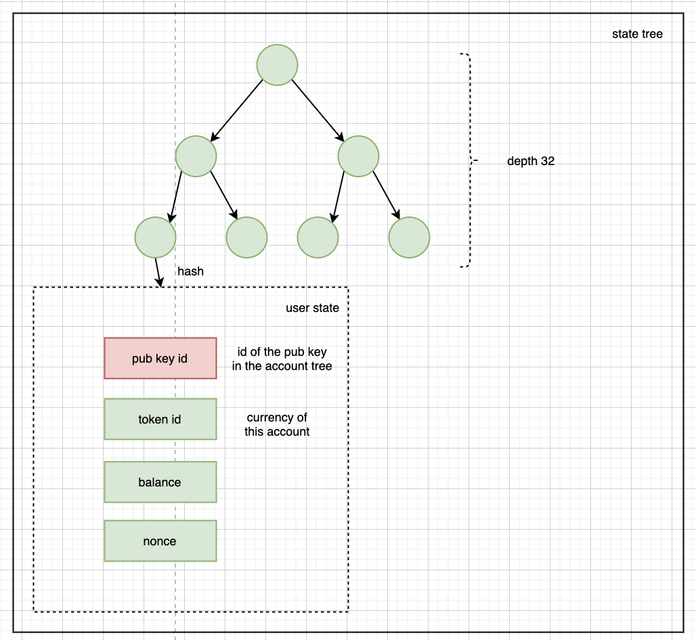

# 🎄 State trees

## Account tree



Used for storage of public keys. The root of the tree is stored in the AccountRegistry smart contract. New accounts can be inserted individually or in batches of 16 pubkeys.

## User state tree



Stores the account state at a point in time. The root of this tree is included in each commitment to represent the state after the transactions in commitment were applied.

## Code references

[https://github.com/thehubbleproject/hubble-commander/blob/c60f42747e633dae53afd202e91550604667be66/core/state.go#L9](https://github.com/thehubbleproject/hubble-commander/blob/c60f42747e633dae53afd202e91550604667be66/core/state.go#L9)

```go
// UserState is the user data stored on the node per user
type UserState struct {
	ID string `json:"-" gorm:"primary_key;size:100;default:'6ba7b810-9dad-11d1-80b4-00c04fd430c8'"`

	// AccountID is the path of the user account in the account Tree
	// Cannot be changed once created
	AccountID uint64 `gorm:"not null;index:AccountID"`

	Data []byte `gorm:"type:varbinary(255)"`

	// Path from root to leaf
	Path string `gorm:"unique;index:Path"`

	// Type of nodes
	// 1 => terminal
	// 0 => root
	// 2 => non terminal
	Type uint64 `gorm:"not null;index:Type"`

	// keccak hash of the node
	Hash string `gorm:"not null;index:Hash"`

	// Depth indicates the depth of the node
	Depth uint64 `gorm:"not null;index:Level"`

	// IsReserved allows services to reserve the rights of occupying the leaf
	IsReserved bool `gorm:"not null;"`
}
```

This struct is used to store the account tree, only the leaf nodes have the `Data` populated.

Data is defined by the `[UserState](https://github.com/thehubbleproject/hubble-contracts/blob/7b75d55d603b20763dd5b0a3cab2242a84352e75/contracts/libs/Types.sol#L196)` struct

```go
struct UserState {
      uint256 pubkeyID;
      uint256 tokenID;
      uint256 balance;
      uint256 nonce;
  }
```

The accounts are created when the initial deposit is finalized: [https://github.com/thehubbleproject/hubble-commander/blob/c60f42747e633dae53afd202e91550604667be66/db/deposit.go#L73](https://github.com/thehubbleproject/hubble-commander/blob/c60f42747e633dae53afd202e91550604667be66/db/deposit.go#L73).

The deposit data is saved in the `DepositQueued` log [https://github.com/thehubbleproject/hubble-contracts/blob/7b75d55d603b20763dd5b0a3cab2242a84352e75/contracts/DepositManager.sol#L10](https://github.com/thehubbleproject/hubble-contracts/blob/7b75d55d603b20763dd5b0a3cab2242a84352e75/contracts/DepositManager.sol#L10)

 [https://github.com/thehubbleproject/hubble-commander/blob/c60f42747e633dae53afd202e91550604667be66/db/state.go#L41](https://github.com/thehubbleproject/hubble-commander/blob/c60f42747e633dae53afd202e91550604667be66/db/state.go#L41)